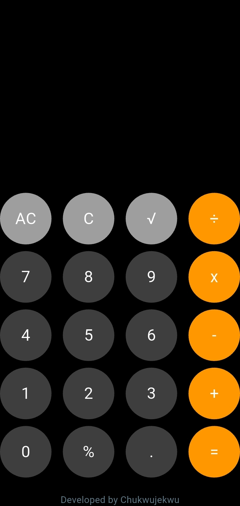

# Flutter Calculator App

A modern, fully-featured calculator app built with Flutter. This project demonstrates clean UI design, state management, and testable business logic for basic arithmetic operations.

---

## 🚀 Features
- Responsive calculator UI for mobile and desktop
- Supports addition, subtraction, multiplication, division
- Square root and percentage calculations
- Error handling (e.g., division by zero)
- Clear (C) and All Clear (AC) functions
- Chained calculations (use result for next operation)
- Custom button widget for consistent design
- Unit and widget tests for reliability

---

## 🛠️ Getting Started

### Prerequisites
- [Flutter SDK](https://flutter.dev/docs/get-started/install)
- Dart (comes with Flutter)

### Installation
1. Clone the repository:
   ```bash
   git clone <your-repo-url>
   cd project_1
   ```
2. Get dependencies:
   ```bash
   flutter pub get
   ```

### Running the App
To run the app on an emulator or device:
```bash
flutter run
```

---

## 📁 Project Structure
```
lib/
  main.dart                # App entry point
  pages/
    calculator.dart        # Calculator UI and state
  components/
    calculator_button.dart # Custom button widget
    calculator_logic.dart  # Pure calculation logic for testing

test/
  widget_test.dart         # Widget/UI tests
  calculator_logic_test.dart # Unit tests for calculation logic
```

---

## 🧮 Calculator Logic
- The main calculation logic is in `calculator_logic.dart` as a pure function:
  ```dart
  double? calculate(double firstNum, double secondNum, String operator)
  ```
- This function is unit tested in `test/calculator_logic_test.dart`.

---

## 🎨 UI Overview
- The calculator UI is built in `calculator.dart` using a `StatefulWidget`.
- Button presses update the display and perform calculations using the logic function.
- Custom `CalculatorButton` widget for consistent button styling and behavior.

---

## 🧪 Testing
- Run all tests:
  ```bash
  flutter test
  ```
- Tests include:
  - Widget/UI tests for display and button interaction
  - Pure logic tests for all arithmetic operations

---

## 📝 Customization
- Change colors, fonts, or button layout in `calculator.dart` and `calculator_button.dart`.
- Extend logic in `calculator_logic.dart` for more operations (e.g., exponentiation).

---

## 🐞 Troubleshooting
- If you see skipped frames or UI lag, ensure logic is separated from UI and avoid heavy computation in the widget tree.
- For test failures, check that the UI and logic match the test expectations.

---

## 📷 Screenshots


---

## 🤝 Contributing
Pull requests are welcome! For major changes, please open an issue first to discuss what you would like to change.

---

## 📄 License
None

---

## 👤 Author
Chukwujekwu